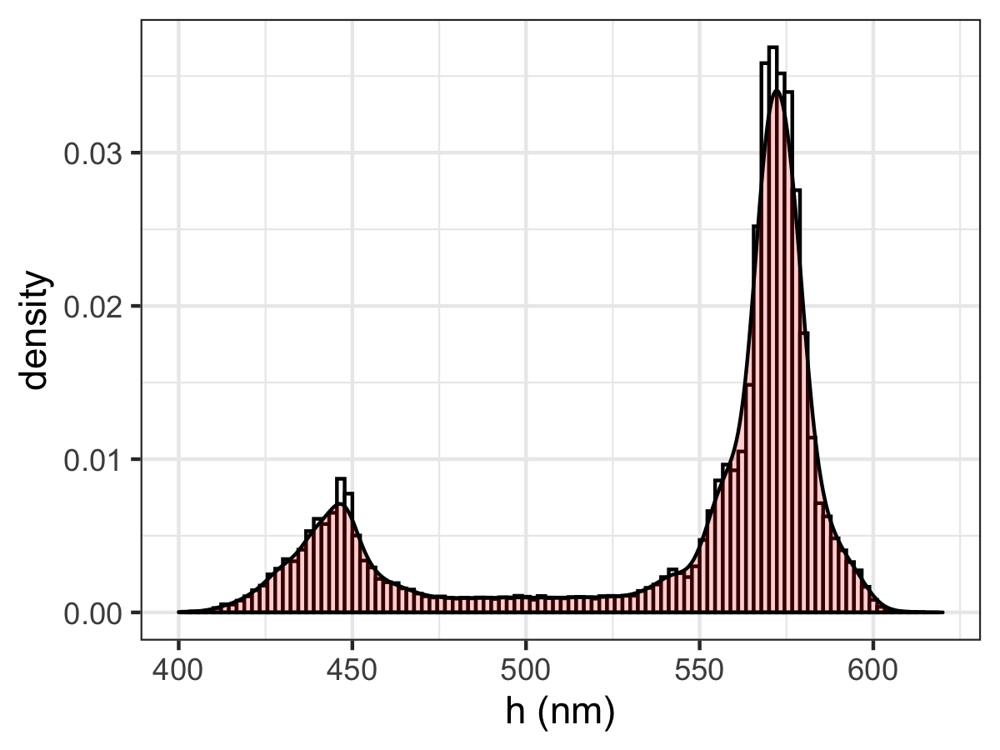
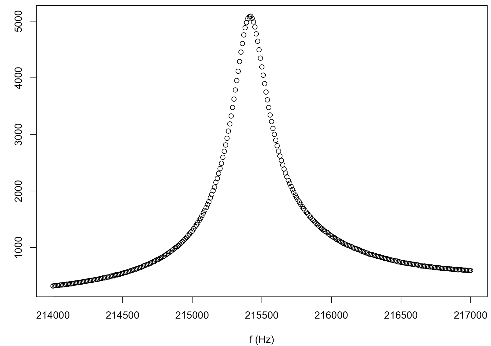

# nanoscopeAFM

Analyzes Atomic Force Microsocpy images; currently four types are supported, images from Nanosurf (.nid), Veeco Multimode Nanoscope III, Park AFM images, and Asylum Research AFM images.


## Installation

```R
# install.packages("devtools")
devtools::install_github("thomasgredig/nanoscopeAFM")
```

## Usage

Use this package to generate `AFMdata` S4 data objects, which can be used to quickly display AFM data and also process AFM data. Here are some examples:

Creating an `AFMdata` data object:

```R
d = AFM.import('image.ibw')
class(d)
```

Print essential data and output a summary:

```R
print(d)
summary(d)
```

Graph the object using ggplot2 package:

```R
plot(d)
```

## not fully supported yet:


Flatten the object with a plane; this generates a new `AFMdata` object:

```R
d2 = AFM.flatten(d)
```


# AFM Images

Loading an AFM image into memory works as follows:

```R
fname = 'image.ibw' # Igor Wavefile, NID file, AR file, or Nanoscope file
d = read.AFM_file(fname)
```

The attributes can be viewed with `str(d)` and include units.

```R
library(ggplot2)
library(scales)

ggplot(d, aes(x.nm, y.nm, fill = z.nm)) + 
  geom_raster() +
  scale_fill_gradient2(mid='white', high=muted('purple')) +
  xlab(expression(paste('x (',mu,'m)'))) +
  ylab(expression(paste('y (',mu,'m)'))) +
  labs(fill='z (nm)') +
  scale_y_continuous(expand=c(0,0))+
  scale_x_continuous(expand=c(0,0))+
  coord_equal() +
  theme_bw()
```

A cross-section of the image can now easily be created:

```R
LINE.NO = 45
d1 = subset(d, y==LINE.NO)
ggplot(d1, aes(x.nm, z.nm)) +
  geom_path(col='black') + 
  geom_point(col='red', size=2) + 
  geom_point(col='white', size=1)+ 
  scale_x_continuous(breaks=0:20*0.2) + 
  xlab(expression(paste('x (',mu,'m)'))) +
  ylab('z (nm)') + 
  theme_bw()
```


## Image Info

Use the `AFM.info()` function to obtain information about the AFM image. The information depends on the file format, but some items are common for all images; these items start with **"INFO."**.

```R
AFM.info(fname) -> r1
r1[grep('INFO.',attr(r1,'names'))]
```

The AFM image information can also be saved into a file.

```R
AFM.info(fname) -> r1
d2 = data.frame(n = attr(r1, "names"), val=r1)
write.csv(d2, file='AFMinfo.csv', row.names = FALSE)
```


## Image Analysis

Histogram can be used to study the roughness or height levels:

```R
# make a histogram
ggplot(d, aes(x=z.nm)) +
    geom_histogram(aes(y=..density..),
    colour="black", fill="white", bins=200)+
    geom_density(alpha=0.2, fill='red')
```




## Frequency Sweep

If the NID file is a frequency sweep, you can display the data using the function `NID.loadSweep` which will return a list that contains data frames with the frequency vs. amplitude data.

```R
q = NID.loadSweep(fname[1])
plot(q[[1]],xlab='f (Hz)', ylab='A')
```



The units for amplitude are stored in the header of the file and can be modified accordingly.


## Line Profile

Using the [Bresenham algorithm](https://en.wikipedia.org/wiki/Bresenham%27s_line_algorithm), the pixel locations along a profile line are computed.


```R
# d is populated with NID.loadImage()
q = NID.lineProfile(d, 0,0,2e-6,2e-6)
d2 = d[q,]
d2$distance = sqrt(d$x*d$x+d$y*d$y)
# plot the line profile
plot(d2$distance, d2$z.flatten)
```

# Nanoscope AFM images


Convert and save all files in folder to PNG format
```R
# find the files
file.list = raw.findFiles(path.RAW, date='2016', instrument='afm')
file.list = file.list[grep('\\d{3}$',file.list)]

# save the first image of each AFM file
for(f in file.list) {
  d = AFM.read(f)
  ggplot() +
    geom_raster(data = d , aes(x = x, y = y, fill = z)) +
    coord_equal(expand=FALSE) +
    xlab('x (nm)') +
    ylab('y (nm)') +
    scale_fill_continuous(name='z (nm)') +
    ggtitle(f)
  filename.png = gsub(str_extract(f, pattern = '\\..{3}$'),'.png',f)
  ggsave(file.path('',filename.png), dpi=300)
}
```

# Deprecated Functions

In version 0.5 and earlier, some additional functions were available, these have been deprecated and should be replaced as follows:

* read.AFM_file() -> AFM.read()
* NID.loadImage() -> AFM.read()
* flatten.NID_matrix() -> AFM.flatten()


# Technical Notes

* The [least significant bit (LSB)](https://masteringelectronicsdesign.com/an-adc-and-dac-least-significant-bit-lsb/) provides the smallest voltage step, given the 16-bit resolution of the NanoScope AFM, then Vref = 2^16*LSB.
* The [header file](http://www.weizmann.ac.il/Chemical_Research_Support/surflab/peter/headers/) is documented for versions 2,3, and 4. [Z-scaling Info](https://bioafm.physics.leidenuniv.nl/dokuwiki/lib/exe/fetch.php?media=afm:nanoscope_software_8.10_user_guide-d_004-1025-000_.pdf)
* [https://www.instructables.com/A-Low-Cost-Atomic-Force-Microscope-%E4%BD%8E%E6%88%90%E6%9C%AC%E5%8E%9F%E5%AD%90%E5%8A%9B%E9%A1%AF%E5%BE%AE%E9%8F%A1/](Low Cost DIY AFM)
* [https://rdrr.io/cran/AFM/](AFM Analysis R package) by Mathieu Beauvais on [https://github.com/cran/AFM](cran/AFM)
