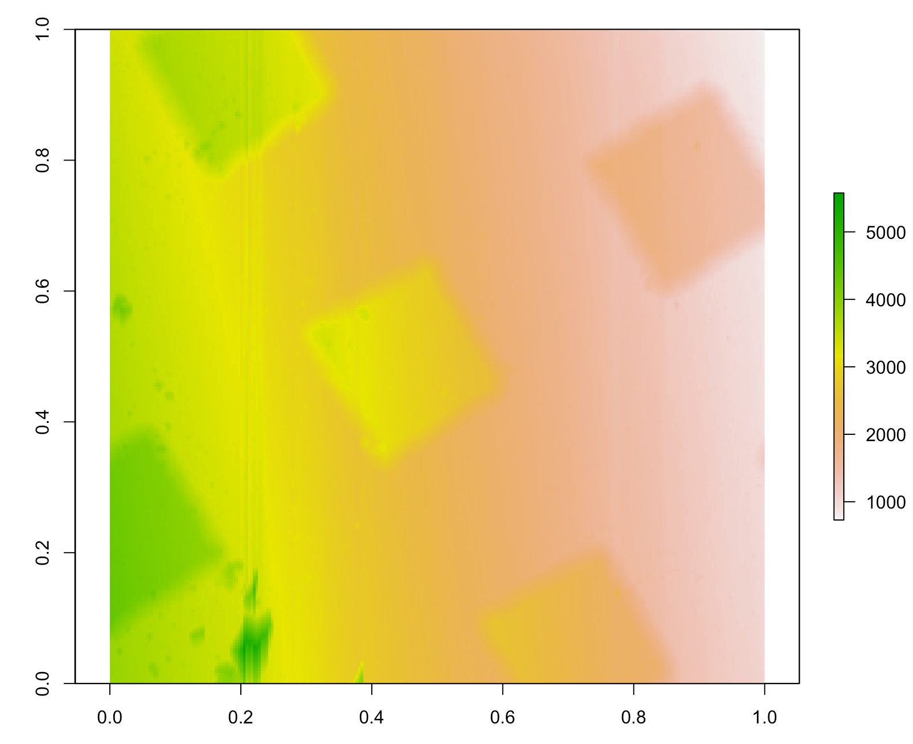

# nanoscopeAFM

Analyzes Atomic Force Microsocpy (AFM) images from nanosurf (.nid) or nanoscope devices.


## Installation

```R
# install.packages("devtools")
devtools::install_github("thomasgredig/nanoscopeAFM")
```

## Description

The main functions from this library are:

- check.NID_file: should return 0
- read.NID_header: reads the header of a NID file
- read.NID_file: read the images from a NID file
- read.NID_Sweep_file: Frequency Sweep NID file


## Example

The image can be loaded into memory using `read.NID_file` as the command, so here is an example:


```R
library(nanoscopeAFM)
fname = dir(pattern='nid$', recursive = TRUE)
d <- read.NID_file(fname[1])
```

Then, `d` will be a list with several images corresponding to the channels. In order to display the image use the raster library. 

```R
library(raster)
# display the first image, which is 256 x 256
m = matrix(d[[1]], nrow=256)
plot(raster(m))
```



You may need to perform additional image analysis, for example you may want to remove the background.
