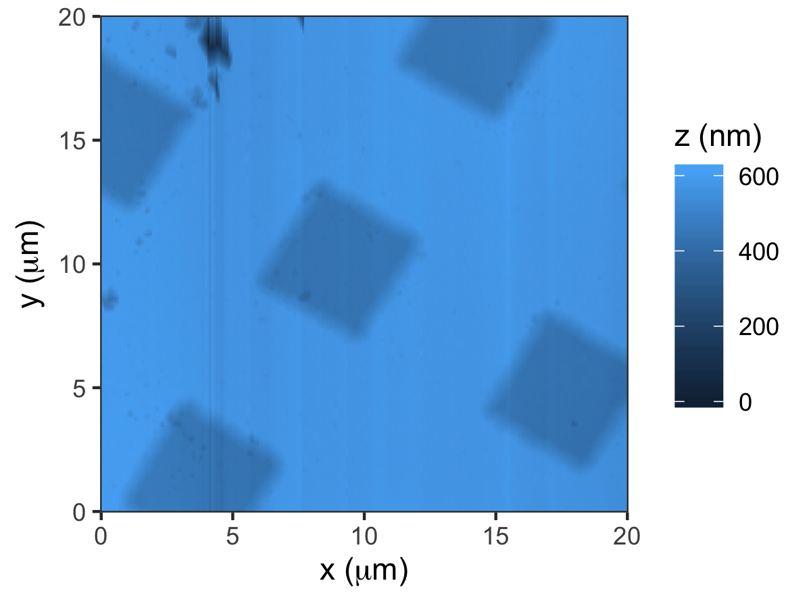
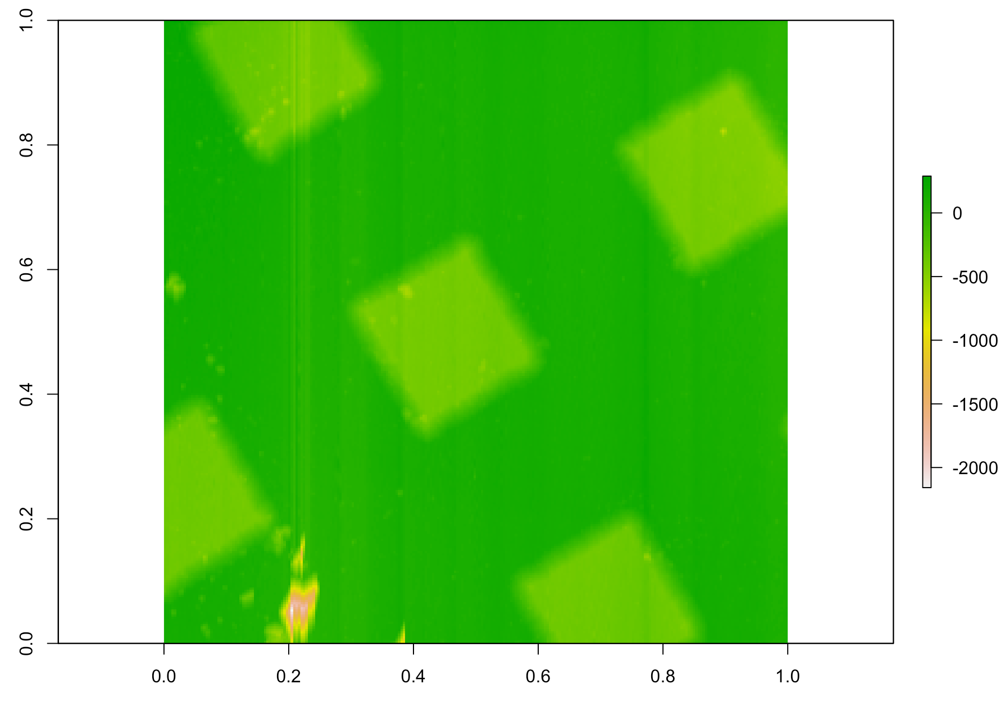

# nanoscopeAFM

Analyzes Atomic Force Microsocpy (AFM) images from nanosurf (.nid) or nanoscope devices.


## Installation

```R
# install.packages("devtools")
devtools::install_github("thomasgredig/nanoscopeAFM")
```

## Description

The main functions from this library are:

- **NID.checkFile**: should return 0
- **NID.loadImage**: loads an NID image
- **NID.loadSweep**: Frequency Sweep NID file


More specialized functions from the library:

- **read.NID_header**: reads the header of a NID file
- **read.NID_file**: read the images from a NID file
- **flatten.NID_matrix**: plane fit to remove background
- **get.NIDchannel.Scale**: returns scales of image


## Example


The image can be loaded into memory using `NID.loadImage` command using a filename and the image number. The image is automatically flattened and contains both the original measurement (z) as well as the flattened image (z.flatten); so here is an example:

```R
library(nanoscopeAFM)
library(ggplot2)
fname = dir(pattern='nid$', recursive = TRUE)
d = NID.loadImage(fname[2],1)

ggplot(d, aes(x*1e6,y*1e6, fill=z.flatten*1e9)) + 
    geom_raster() +
    xlab(expression(paste('x (',mu,'m)'))) + 
    ylab(expression(paste('y (',mu,'m)'))) + 
    labs(fill='z (nm)') +
    scale_y_continuous(expand=c(0,0))+
    scale_x_continuous(expand=c(0,0))+
    theme_bw()
```    
    
The first image is usually a topography channel (z-axis, units of meters) and the second image maybe the cantilever amplitude in units of voltage.




## Image Analysis

Histogram can be used to study the roughness or height levels:

```R
# make a histogram
ggplot(d, aes(x=z.flatten)) + 
    geom_histogram(aes(y=..density..), 
    colour="black", fill="white", bins=200)+
    geom_density(alpha=0.2, fill='red')
```


You may need to perform additional image analysis, for example you may want to remove the background. This can be performed with this code:

```R
library(raster)
m1 = flatten.NID_matrix(m)
plot(raster(m1))
```



## Frequency Sweep

If the NID file is a frequency sweep, you can display the data using the function `NID.loadSweep` which will return a list that contains data frames with the frequency vs. amplitude data.

```R
q = NID.loadSweep(fname[1])
plot(q[[1]],xlab='f (Hz)', ylab='A')
```


The units for amplitude are stored in the header of the file and can be modified accordingly.


# Nanoscope AFM images

Similar functions are available for Nanoscope files

```R
fname = dir(pattern='\\.\\d+$', recursive = TRUE)
d = read.Nanoscope_file(fname[1])
bin.data = d[[1]]
library(raster)
m = matrix(bin.data, nrow=sqrt(length(bin.data)))
plot(raster(m))
```
