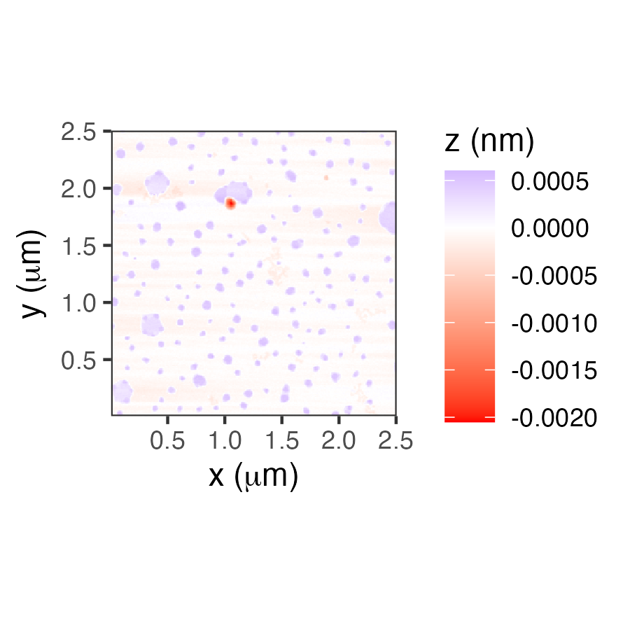

[](https://zenodo.org/badge/latestdoi/184698455)

# nanoscopeAFM  

Imports and analyzes Atomic Force Microsocpy images; currently four types are supported, images from Nanosurf (.nid), Veeco Multimode Nanoscope III (.000), Park AFM images (.tiff), and Asylum Research AFM images (.ibw).


## Installation

Use the latest release from the GitHub repository:

```R
# install.packages("devtools")
devtools::install_github("thomasgredig/nanoscopeAFM")
```

## Data Classes

Several new data structures (S3 and S4) are introduced:

- `AFMdata` - S4 class that contains all AFM images from a file
- `AFMinfo` - S3 class that contains all parameters of the AFM images, such as vibration frequnecy, etc.
- `AFMmath` - S3 class that contains computed paramters, such as roughness, etc. about a particular AFM image

## Usage

Complete descriptions for [nanoscopeAFM library functions](https://thomasgredig.github.io/nanoscopeAFM/) and examples in the [Article Vignettes](https://thomasgredig.github.io/nanoscopeAFM/articles/AFM-graphTypes.html).

Use this package to generate `AFMdata` S4 data objects, which can be used to quickly display AFM data and also process AFM data. Here are some examples:

Creating an `AFMdata` data object:

```R
d = AFM.import('image.ibw')
class(d)
```

Print essential data and output a summary:

```R
print(d)
summary(d)
```

Graph the object using ggplot2 package:

```R
plot(d)
```


## Image Info

Use the `AFMinfo()` function to obtain information about the AFM image. The information depends on the file format, but some items are common for all images; these items start with **"INFO."**.

```R
r1 = AFMinfo(fname)
summary(fname)
```

The AFM image information can also be saved into a file.

```R
write.csv(r1$data, file='AFMinfo.csv', row.names = FALSE)
```


## Image Analysis

Several functions are available for image analysis, including:

* [Flatten image](https://thomasgredig.github.io/nanoscopeAFM/reference/AFM.flatten.html)
* [Histogram](https://thomasgredig.github.io/nanoscopeAFM/reference/AFM.histogram.html)
* [Profile lines](https://thomasgredig.github.io/nanoscopeAFM/reference/AFM.linePlot.html)
* [Roughness analysis](https://thomasgredig.github.io/nanoscopeAFM/reference/AFM.math.params.html)


# Technical Notes

* The [least significant bit (LSB)](https://masteringelectronicsdesign.com/an-adc-and-dac-least-significant-bit-lsb/) provides the smallest voltage step, given the 16-bit resolution of the NanoScope AFM, then Vref = 2^16*LSB.
* The [header file](http://www.weizmann.ac.il/Chemical_Research_Support/surflab/peter/headers/) is documented for versions 2,3, and 4. [Z-scaling Info](https://bioafm.physics.leidenuniv.nl/dokuwiki/lib/exe/fetch.php?media=afm:nanoscope_software_8.10_user_guide-d_004-1025-000_.pdf)
* [Low Cost DIY AFM](https://www.instructables.com/A-Low-Cost-Atomic-Force-Microscope-%E4%BD%8E%E6%88%90%E6%9C%AC%E5%8E%9F%E5%AD%90%E5%8A%9B%E9%A1%AF%E5%BE%AE%E9%8F%A1/)
* [AFM Analysis R package](https://rdrr.io/cran/AFM/) by Mathieu Beauvais on [cran/AFM](https://github.com/cran/AFM)
